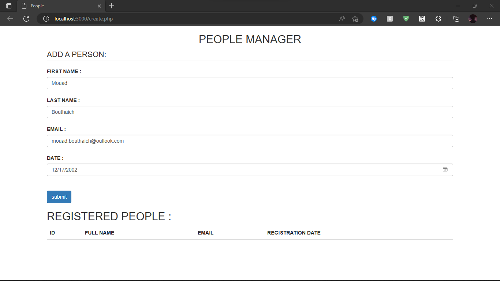
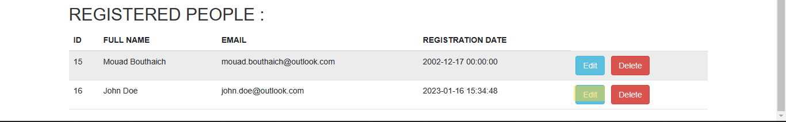
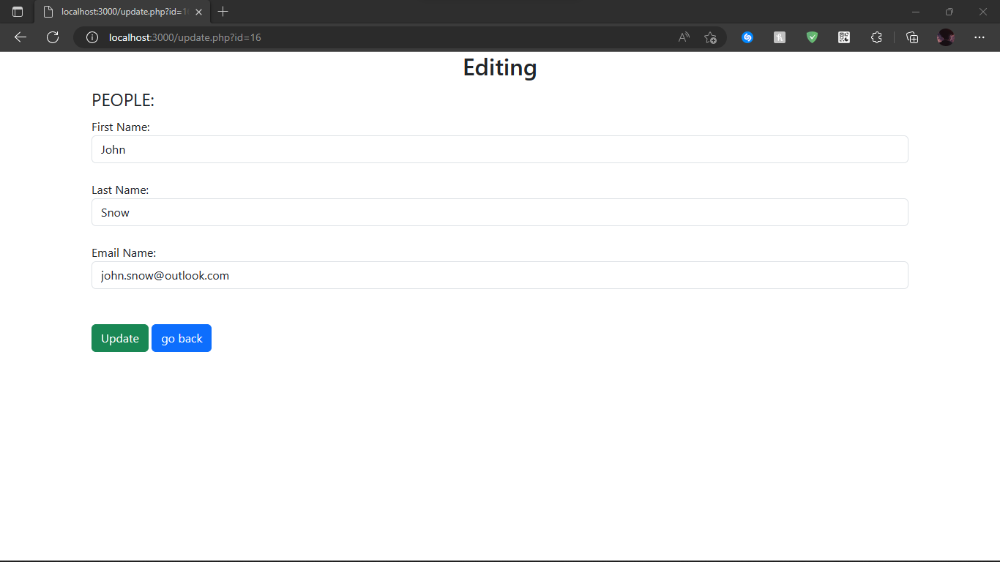
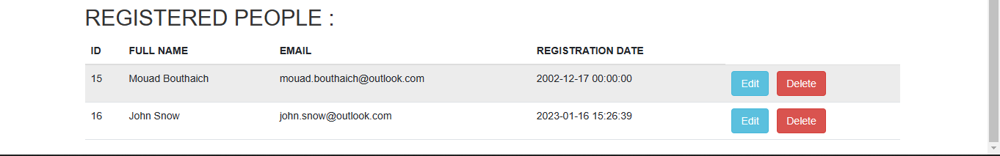

# PHP-Project

A simple user management system (People Manager).

## Description
This project represents a simple user management system (CRUD) using PHP as the programming language, MySQL for data persistence and Bootstrap for a simplistic UI. It can handle User:
<ul>
  <li>Addition</li>
  <li>Deletion</li>
  <li>Update</li>
  <li>Modification</li>
</ul>

### Addition
To add a new User (Person), fill out the required text fields and click on the "submit" button:
 

 
You should be able to view our latest addition in the list below:
 

 
### Deletion
To remove a User (Person), click on the delete button next to the target user:
 

 
The results list should be updated immediately:
 

 

### Modification and Update
To modify the information of a User (Person), click on the edit button next to the target user:
 

 

You will be redirected to a new page where you can modify the information as you see fit:
 

 

After modifying the information, click on "Update" and then click on the "go back" button to be redirected to the page containing the Users list:
 

 

You should be able to view the latest modification take place immediately:
 

 
